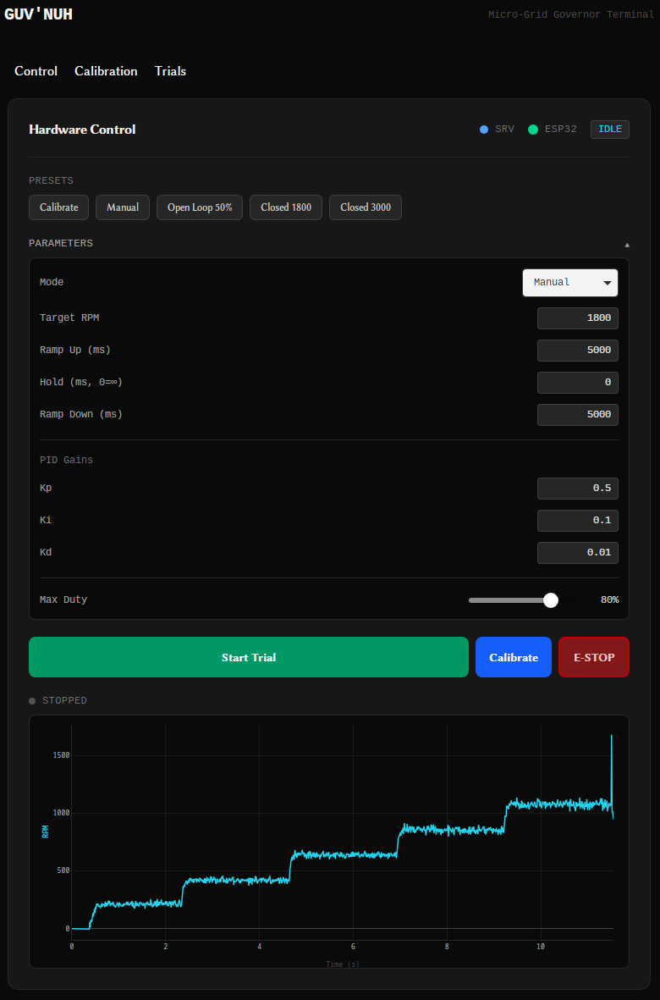
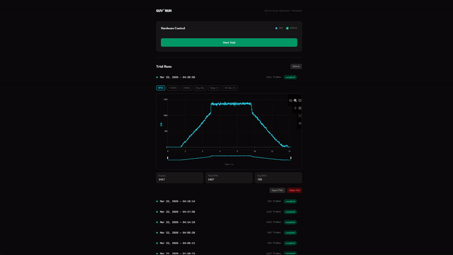
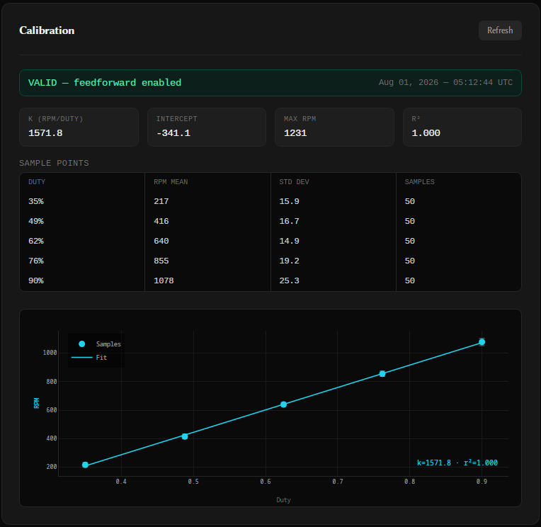

# Guv'nuh – Resilient Micro-Grid Control Platform




A laboratory-scale governor architecture that converts a standard DC motor into a
**secure, programmable micro-generator testbed**. This platform demonstrates a
"Zero-Trust" industrial control loop, fusing hard real-time safety (STM32/RTIC)
with secure cloud telemetry (Rust/Dioxus/SurrealDB).

---

## Project Purpose

> To engineer a governor reference design that decouples **Physics** (safety
> critical) from **Connectivity** (telemetry), demonstrating the complete
> engineering pipeline from firmware to cloud SCADA — with the architecture
> designed against IEC 61508 and IEEE 1547 as guiding standards.

---

## Functional Scope

### Phase 1 — Governor Brains (Current)

| ID | Requirement | Target Value | Status |
| --- | --- | --- | --- |
| **F-01** | Closed-loop speed regulation (PID) | ±2% droop, 0–1 kW range | 🔄 In Progress |
| **F-02** | Overspeed trip to safe torque-off | < 12 ms (planned hardware interrupt) | 📋 Planned |
| **F-03** | Load Rejection Response | Recovery < 2s (100% → 0% Load Step) | 🔄 In Progress |
| **F-04** | Async Boot MCU Handshake | Machine locked until gateway ready | ✅ Complete |
| **F-05** | Telemetry Segregation | "Air-gapped" UART Link | ✅ Complete |
| **F-06** | Intranet Telemetry Stream | Live Telemetry over TCP/WiFi | ✅ Complete |
| **F-07** | Prelude-Based Run Configuration | `Configure(RunConfig)` before `Start` | ✅ Complete |
| **F-08** | Live Parameter Adjustment | Duty / RPM / PID gains adjustable mid-run | ✅ Complete |
| **F-09** | Interrupt-Driven Command RX | Overrun-free UART command reception | ✅ Complete |
| **F-10** | Trial Run Recording | Per-trial telemetry to SurrealDB | ✅ Complete |
| **F-11** | Telemetry Visualization | Plotly.js time-series with metric toggles | ✅ Complete |
| **F-12** | REST Hardware API | Stateless control + data endpoints on :3001 | ✅ Complete |
| **F-13** | Duty→RPM Calibration | On-device least-squares fit with validation | ✅ Complete |
| **F-14** | Feedforward Control | Calibration coefficient seeds PID duty | ✅ Complete |
| **F-15** | Calibration Reporting | Fit + raw points persisted, drift-tracked | ✅ Complete |

### Phase 2 — EtherCAT Integration

Replaces the UART telemetry link with an EtherCAT fieldbus, enabling
deterministic sub-millisecond communication between the Governor and
downstream field devices. This phase targets industrial interoperability
and positions the platform against real SCADA deployments.

### Phase 3 — 48V Storage Converters

Integrates bidirectional DC-DC converters for a 48V battery storage bank,
enabling islanded operation, load leveling, and grid-forming capability.
Adds a second control loop for state-of-charge management alongside the
existing speed governor.

### Phase 4 — Micro Steam Turbine *(Future Reference)*

> ⚠️ High temperature and pressure — deferred until Phase 1 control logic
> is fully validated and hardened.

Replaces the DC motor testbed with a purpose-built micro steam turbine as
the prime mover, completing the generator set. The Governor architecture
is designed from the ground up to support this transition — the state
machine, safety interlocks, and telemetry pipeline require no fundamental
changes, only physical plant reconfiguration. The calibration architecture
anticipates this fork: the device fits only the simple relationship it needs
to control autonomously, while the server retains raw sample points for
richer analysis (nonlinear maps, drift) that can evolve without reflashing.

---

## System Architecture

```
┌──────────────────────────────────────────────────────────────┐
│                       SAFETY DOMAIN                          │
│                                                              │
│   AMT102-V Encoder ──► STM32H753 (RTIC)                     │
│   ACS772 Current   ──►   ├── State Machine (14 states)      │
│   ADS131M04 ADC    ──►   ├── PID Loop + Feedforward         │
│                          ├── Calibrator (duty→RPM fit)      │
│                          ├── Ramp Generator                  │
│                          ├── MotorController (inverted PWM)  │
│                          ├── UART4 RX ISR (cmd decode)       │
│                          └── UART TX/RX ──────────────┐      │
└───────────────────────────────────────────────────────┼──────┘
                                                        │ UART
┌───────────────────────────────────────────────────────┼──────┐
│                    TELEMETRY DOMAIN                   │      │
│                                                       ▼     │
│   ESP32-WROOM ◄──── UART RX (GPIO16)                        │
│       ├── Handshake Manager                                  │
│       ├── WiFi (esp-wifi + embassy-net)                      │
│       ├── TCP Server :3000 (bidirectional) ──────────────►  │
│       └── CMD forwarding (TCP → UART → STM32)                │
└──────────────────────────────────────────────────────────────┘
                                          │ TCP/WiFi
┌─────────────────────────────────────────▼────────────────────┐
│                     COMMAND DOMAIN                            │
│                                                              │
│   gaussindustri.es Server (Dioxus Fullstack + Axum)          │
│       ├── ingest_loop: ESP32 TCP → postcard/COBS decode      │
│       ├── Uplink demux: Telemetry vs Calibration frames      │
│       ├── frame sanity gate: reject non-finite / OOR values  │
│       ├── SurrealDB: trial + telemetry + calibration storage │
│       ├── live_buffer: frame-indexed ring for polling        │
│       └── REST API :3001 (hardware control + trial data)     │
│                                                              │
│   Desktop Terminal (Dioxus Desktop)                          │
│       ├── Tabs: Control / Calibration / Trials               │
│       ├── Run Configurator: RunMode + params + presets       │
│       ├── Trial Control: Configure→Start / Stop / E-Stop     │
│       ├── Live Control: real-time duty adjustment (Manual)   │
│       ├── Calibration Panel: fit stats + points + fit chart  │
│       ├── Connection Status: ESP32 + Server + STM32 state    │
│       ├── Trials Dashboard: accordion list of recorded runs  │
│       └── Plotly.js Charts: RPM, V, I, Freq, Temp, DC Bus   │
└──────────────────────────────────────────────────────────────┘
```

### 1. The Governor (STM32H753 + RTIC)

- **Role:** The "Physics Engine."
- **Responsibility:** State machine, PWM motor control, encoder RPM sampling,
  duty→RPM calibration, feedforward + PID control, safety interlocks, command
  reception.
- **Command Reception:** A dedicated **UART4 RX interrupt** (priority 3) drains
  the FIFO the instant bytes arrive, accumulates COBS frames, decodes them into
  `Command`s, and hands them to the priority-1 state machine through a
  `heapless::Deque` queue. This decouples reception speed from the 10 ms control
  tick and eliminates FIFO overrun on multi-byte command frames (e.g. a full
  `Configure(RunConfig)`).
- **Calibration:** A `CALIBRATE` run steps through a fixed set of duty levels,
  lets RPM settle at each, and computes a least-squares `duty → RPM` line
  (slope `k`, intercept, r²) using Welford accumulation for per-point mean and
  standard deviation. A validation gate (minimum r², positive plausible slope,
  per-point coefficient-of-variation ceiling) marks the fit `valid` or rejects
  it — a rejected fit is still reported but does not enable feedforward.
- **Feedforward:** When a valid calibration exists, closed-loop states compute a
  feedforward duty from `k` and the target RPM, so PID trims a small residual
  around an already-near-correct duty instead of integrating up from zero. The
  path is conditional — with no calibration, PID runs exactly as before.
- **Telemetry Task:** Reads the encoder, writes a shared `Measurements` struct,
  assembles a `Telemetry` frame from it, and drives the UART. A single-slot
  `pending_report` mailbox lets the `CALIBRATE` state hand a completed
  calibration report to the telemetry task (the sole owner of the transmitter)
  without two-task contention on `tx`.
- **State Machine:** `BOOT` → `IDLE` → `CONFIGURED` → *(mode-dependent)*, with
  a graceful `RAMP_DOWN` on stop and `FAULT` / `ESTOP` reachable from any state.
- **Boot Handshake:** STM32 sends `HELLO` over UART until the ESP32 responds
  `OK`, then arms the RX interrupt and transitions to `IDLE`.
- **Motor Abstraction:** `MotorController` encapsulates the inverted-PWM logic
  (duty MAX = motor off) behind a `set_speed(fraction)` API with a configurable
  safety duty clamp.

### 2. The Gateway (ESP32-WROOM + esp-hal)

- **Role:** The "Scribe."
- **Responsibility:** Receives telemetry from the STM32 over UART, connects to
  WiFi, and streams data to TCP clients on port 3000. Forwards commands from
  the server back to the STM32 over UART.
- **FIFO Draining:** The UART→TCP bridge drains all available bytes per loop
  iteration rather than one byte at a time, so it keeps pace with the 100 Hz
  telemetry stream and the burst of a calibration report without overrunning the
  ESP32's RX FIFO (which would corrupt frames mid-flight).
- **Isolation:** Connected via UART only. The ESP32 cannot directly access
  any Governor control variables — all communication is through a sanitized
  COBS message protocol. The gateway is a dumb byte pipe: it forwards frames
  without interpreting their contents, so the wire format can evolve (e.g. the
  `Uplink` enum, added calibration frames) with zero gateway changes.

### 3. The Server (Dioxus Fullstack + Axum + SurrealDB)

- **Role:** The "Command Center."
- **Ingest Loop:** Connects to ESP32 over TCP, decodes postcard/COBS frames as
  an `Uplink` enum, and demultiplexes: `Telemetry` frames flow to the live
  buffer and (during a trial) to SurrealDB; `Calibration` frames are persisted
  as calibration records. A sanity gate rejects telemetry with non-finite or
  physically impossible values so transient wire corruption never reaches
  storage or the chart.
- **Trial System:** Each trial run creates a `trial` record with start/stop
  timestamps, frame count, and status. Telemetry frames are tagged with
  `trial_id` for isolated retrieval.
- **Calibration Store:** A completed calibration is stored as a `calibration`
  record — the fit (`k`, intercept, max RPM, r², valid flag) **and** the raw
  sample points (duty, mean RPM, standard deviation, sample count), tagged with
  `rig_id` and the originating `trial_id`. Storing both the reduced fit and the
  raw acquisition mirrors a calibration certificate: the fit is the conclusion,
  the points are the evidence, and successive records reveal mechanical drift.
- **Live Buffer:** A frame-indexed ring buffer feeds the desktop's polling
  chart with a monotonic `ts_s` x-axis derived from frame index (100 Hz), so
  the trace is independent of the STM32 boot clock.
- **REST API (`:3001`):** Stateless hardware control and data query endpoints
  consumed by the desktop terminal.

### 4. The Desktop Terminal (Dioxus Desktop)

- **Role:** The "Operator Console."
- **Tabbed Layout:** Control, Calibration, and Trials, each a focused panel.
- **Run Configurator:** Select a `RunMode`, set target RPM, ramp/hold timings,
  PID gains, and a max-duty safety clamp — or apply a named **preset** with one
  click. The full `RunConfig` is sent as a prelude before the run begins.
- **Trial Control:** Start sends `Configure` then `Start`; Stop ramps down
  gracefully; a dedicated Calibrate button runs the calibration preset; an
  always-available **E-Stop** kills the motor immediately.
- **Live Control:** In Manual mode, a duty slider streams real-time
  `LiveAdjust(Duty)` commands to the motor while it runs.
- **Calibration Panel:** Shows the latest fit with a validity banner, the fit
  statistics (`k`, intercept, max RPM, r²), the sampled points table, and a
  Plotly scatter of the points with per-point standard-deviation error bars and
  the fitted line superimposed. A history table tracks the coefficient and fit
  quality across runs to surface mechanical drift over time.
- **State-Aware Trials:** The terminal reads the live STM32 state and
  auto-closes a trial when the hardware returns to `IDLE` on its own (e.g. after
  a calibration sequence or a timed hold completes).
- **Trials Dashboard:** Accordion list of all recorded trials with status,
  timestamps, and frame counts. Expand to view interactive Plotly.js charts.
- **Metric Toggles:** RPM, Voltage RMS, Current RMS, Frequency, Temperature,
  DC Bus Voltage — each independently toggleable with dual y-axes.
- **Export:** One-click PNG export of charts for reports and client deliverables.

---

## State Machine

The Governor's behavior after `Start` is determined by the `RunMode` supplied in
the preceding `Configure` prelude:

```
BOOT ──► IDLE ──(Configure)──► CONFIGURED ──(Start)──┐
                                                     │
        ┌────────────────────────────────────────────┤
        │                                             │
   RunMode::Calibrate ──► CALIBRATE ──────────────────┤ (step duties → fit → report → IDLE)
   RunMode::Manual    ──► MANUAL ────────────────────┤ (live duty control)
   RunMode::OpenLoop  ──► SPOOLUP ───────────────────┤ (ramp, no feedback)
   RunMode::ClosedLoop──► SPOOLUP ───────────────────┤ (feedforward + PID on RPM)
   RunMode::Generate  ──► SPOOLUP ──► EXCITE ──► PLL_LOCK ──► READY ──► GENERATE
                                                                          │
                                                                   LOAD_REJECTION
                                                                          │
        Any running state ──(Stop)──► RAMP_DOWN ──► IDLE                  │
        Any state ──(EmergencyStop)──► ESTOP                             │
        Any state ──(fault)──► FAULT                                     │
        FAULT / ESTOP ──(ClearFaults | Stop)──► IDLE ◄───────────────────┘
```

`CALIBRATE`, `OpenLoop`, and `ClosedLoop` are validated on hardware today, with
feedforward from calibration feeding the closed-loop path. The full generator
sequence (`EXCITE → PLL_LOCK → READY → GENERATE → LOAD_REJECTION`) is scaffolded
with time-based placeholders pending ADC sensor integration.

---

## Calibration & Feedforward

A `CALIBRATE` run characterizes the prime mover and feeds the result back into
control:

1. **Acquisition.** The `Calibrator` holds each of several duty levels for a
   settling period, then samples RPM over a tail window — accumulating mean and
   standard deviation per point via Welford's method (no sample buffering).
2. **Fit.** A least-squares line through the `(duty, mean RPM)` points yields
   the coefficient `k` (RPM per unit duty), the intercept, and r². Extrapolating
   to duty = 1.0 gives a practical max RPM.
3. **Validation.** The fit is accepted only if r² clears a floor, the slope is
   positive and plausible, and every point's coefficient of variation is within
   a ceiling. Low-duty points near the friction floor are the usual failure
   mode — the same absolute encoder noise is a larger *fraction* of a small RPM.
   A rejected fit is still reported, but does **not** enable feedforward.
4. **Feedforward.** With a valid fit, closed-loop states command a feedforward
   duty derived from `k` and the target RPM; PID then trims the small remaining
   error. The integrator no longer crawls up from zero, which sharpens the
   response — the value of measuring `k` in the first place.

**Division of labor.** The device computes only the simple linear fit it needs
to control autonomously (a control loop cannot depend on a network round-trip),
and holds it in shared state for feedforward. It reports the raw sample points
upward so the server can perform richer analysis — nonlinear fits, outlier
rejection, drift comparison across runs — and eventually push a lookup table
back down via the `Configure` prelude, all without reflashing firmware attached
to a spinning mass. This is the seam the Phase 4 turbine fork is built around.



---

## REST API Reference

All endpoints served on `:3001`.

| Method | Endpoint | Description |
| --- | --- | --- |
| `GET` | `/api/hw/status` | ESP32 connection state, trial active, current trial ID |
| `POST` | `/api/hw/configure` | Send a `RunConfig` prelude without starting a trial |
| `POST` | `/api/hw/start` | Send `Configure` + `Start`, create trial record |
| `POST` | `/api/hw/adjust` | Send a `LiveAdjust(LiveParam)` while running |
| `POST` | `/api/hw/stop` | Send `Command::Stop`, close trial with frame count |
| `POST` | `/api/hw/estop` | Send `Command::EmergencyStop`, mark trial estopped |
| `GET` | `/api/hw/live` | Poll live frames since a counter (frame-indexed) |
| `GET` | `/api/trials` | List all trials, newest first |
| `GET` | `/api/trials/{id}` | Single trial metadata + all telemetry frames |
| `DELETE` | `/api/trials/{id}` | Delete trial and associated telemetry frames |
| `GET` | `/api/calibration` | Latest calibration record (fit + points) |
| `GET` | `/api/calibration/history` | All calibration records, newest first (drift) |

---

## Data Flow

```
Desktop "Start Trial" → POST /api/hw/start (body: RunConfig)
  → send Command::Configure(RunConfig) → TCP → ESP32 → UART → STM32
      → STM32: IDLE → CONFIGURED
  → SurrealDB: CREATE trial record
  → send Command::Start → TCP → ESP32 → UART → STM32
      → STM32: CONFIGURED → (mode-dependent run state)

STM32 telemetry (100Hz) → UART → ESP32 → TCP → Server
  → postcard::from_bytes_cobs::<Uplink>()
    → Uplink::Telemetry(frame)
      → sanity gate (finite + in-range)
      → live_buffer::push_frame()   (feeds desktop chart)
      → SurrealDB: CREATE telemetry { trial_id, rpm, duty_percent, state, ... }

STM32 calibration complete → Uplink::Calibration(report) → (same pipe)
  → Server: store_calibration
    → SurrealDB: CREATE calibration { rig_id, trial_id, k, intercept,
                                      max_rpm, r_squared, valid, points[...] }

Desktop live duty drag (Manual) → POST /api/hw/adjust {"Duty": 0.3}
  → Command::LiveAdjust(Duty(0.3)) → TCP → ESP32 → UART → STM32

Desktop "Stop Trial" → POST /api/hw/stop
  → Command::Stop → TCP → ESP32 → UART → STM32: → RAMP_DOWN → IDLE
  → SurrealDB: UPDATE trial SET status='completed', frame_count=N
```

---

## Wire Protocol

All firmware↔server communication uses **postcard** serialization with
**COBS** framing (0x00 delimiter). Uplink frames are wrapped in an `Uplink`
enum so a single byte stream carries both telemetry and calibration reports;
the gateway forwards them opaquely and the server demultiplexes on decode.

```rust
// shared/src/models/telemetry/telemetry.rs

pub enum Uplink {
    Telemetry(Telemetry),
    Calibration(CalibrationReport),
}

pub struct Telemetry {
    pub ts_ms: u32,
    pub state: STATE,
    pub rpm: f32,
    pub duty_percent: f32,
    pub v_gen_rms: f32,
    pub i_gen_rms: f32,
    pub freq_gen_hz: f32,
    pub theta_err_rad: f32,
    pub temp_c: f32,
    pub dc_bus_v: f32,
    pub run_mode: Option<RunMode>,
    pub fault: Option<Fault>,
}

// Emitted once when a CALIBRATE run completes. Fixed-size arrays only —
// shared is no_std, no heap. The server adds ids/timestamps on store.
pub struct CalibrationReport {
    pub ts_ms: u32,
    pub k_rpm_per_duty: f32,
    pub rpm_intercept: f32,
    pub max_rpm: f32,
    pub r_squared: f32,
    pub points: [CalPointWire; CAL_POINT_COUNT],
    pub point_count: u8,
    pub valid: bool,
}

pub struct CalPointWire {
    pub duty: f32,
    pub rpm_mean: f32,
    pub rpm_stddev: f32,
    pub samples: u32,
}

pub enum Command {
    Ping,
    Configure(RunConfig),   // prelude sent before Start
    Start,
    Stop,
    EmergencyStop,
    LiveAdjust(LiveParam),  // real-time parameter changes
    Set(Setpoints),         // legacy
    ClearFaults,
}

pub struct RunConfig {
    pub mode: RunMode,          // OpenLoop | ClosedLoop | Calibrate | Manual | Generate
    pub target_rpm: f32,
    pub ramp_up_ms: u32,
    pub hold_ms: u32,           // 0 = hold indefinitely until Stop
    pub ramp_down_ms: u32,
    pub pid: PidGains,          // kp, ki, kd, output_min, output_max
    pub max_duty_clamp: f32,    // 0.0–1.0 safety limit
    pub target_freq_hz: f32,
    pub target_v_rms: f32,
}

pub enum LiveParam {
    Duty(f32),
    TargetRpm(f32),
    PidGains(PidGains),
    MaxDutyClamp(f32),
    TargetFreqHz(f32),
    TargetVRms(f32),
}
```

---

## Technology Stack

| Layer | Implementation | Rationale |
| --- | --- | --- |
| **Safety Core** | Rust RTIC on STM32H753 | Zero-cost abstractions, data-race freedom |
| **Command RX** | UART4 interrupt + heapless queue | Overrun-free reception, decoupled from control tick |
| **Calibration** | On-device least-squares + validation | Autonomous fit; raw points reported for richer server analysis |
| **Control** | Feedforward + PID + Ramp generator | Coefficient-seeded duty, closed-loop trim (tuning WIP) |
| **Telemetry Gateway** | esp-hal + embassy-net on ESP32 | no_std WiFi, memory-safe networking, opaque byte pipe |
| **Transport** | UART (3.3V) + TCP/WiFi | Hardware isolation between domains |
| **Backend** | Axum + SurrealDB | Type-safe async Rust API |
| **Frontend** | Dioxus Fullstack + Desktop | Shared types from firmware to UI |
| **Visualization** | Plotly.js | Interactive charts, PNG export for reports |
| **Desktop** | Dioxus Desktop + reqwest | Native operator console |
| **Safety** | Hardware Interrupt + Watchdog (WIP) | Fail-safe torque-off (design target: SIL-2) |

---

## Repository Structure (Cargo Workspace)

```text
.
├── shared/                    ↳ Wire-safe data models (no_std, serde + postcard)
│   └── src/models/
│       ├── state/states.rs    ↳ STATE enum (14 states) + Fault enum
│       └── telemetry/         ↳ Uplink, Telemetry, CalibrationReport, Command,
│                                RunConfig, LiveParam, PidGains, CalPointWire
├── firmware/
│   ├── stm32/                 ↳ Hard Real-Time Governor (RTIC, no_std)
│   │   └── src/
│   │       ├── main.rs        ↳ State machine, UART4 RX ISR, telemetry task
│   │       ├── models/        ↳ Measurements (shared sensor struct)
│   │       └── guv/
│   │           ├── motor.rs      ↳ MotorController (inverted PWM abstraction)
│   │           ├── pid.rs        ↳ PID controller (anti-windup, hot-swap gains)
│   │           ├── ramp.rs       ↳ Linear ramp generator
│   │           ├── calibrate.rs  ↳ Calibrator: duty→RPM fit, validation, feedforward
│   │           └── states/       ↳ boot, calibrate, idle, estop, fault...
│   └── esp32/                 ↳ Telemetry Gateway (esp-hal, no_std)
│       └── src/main.rs        ↳ Handshake, WiFi, TCP server, UART bridge
├── docs/
│   ├── 00_requirements/       ↳ Project Charter
│   ├── 45_µcu_reference/      ↳ STM32H753 + ESP32-WROOM datasheets
│   ├── 50_motor_drive_data/   ↳ ACS772, ADS131M04, INA240, AMT102-V
│   └── 90_release_notes/      ↳ Roadmap
├── hardware/                  ↳ KiCad sources, BOMs (WIP)
├── githubMedia/               ↳ Preview images
└── ci/                        ↳ GitHub Actions (Cross-compile + Test)
```

---

## Current State (August 2026)

### Validated End-to-End on Hardware

- ✅ STM32H753 boots, asserts safe PWM state, enables relay
- ✅ UART handshake between STM32 and ESP32 (`HELLO` / `OK`)
- ✅ AMT102-V rotary encoder reading RPM via QEI (TIM2)
- ✅ PWM motor control via TIM1 (inverted logic) behind `MotorController`
- ✅ Telemetry transmitted over UART to ESP32 (postcard/COBS, 100Hz)
- ✅ ESP32 connects to 2.4GHz WiFi via esp-wifi + embassy-net
- ✅ TCP server on port 3000 streams live telemetry to server
- ✅ ESP32 FIFO-draining UART bridge — no frame corruption under burst load
- ✅ Bidirectional pipeline — desktop commands forwarded to STM32
- ✅ Interrupt-driven UART4 command RX — no FIFO overrun on `Configure` frames
- ✅ Prelude-based configuration — `Configure(RunConfig)` gates `Start`
- ✅ RunMode branching — Calibrate / Manual / OpenLoop / ClosedLoop validated
- ✅ Duty→RPM calibration — on-device least-squares fit with r² + validation
- ✅ Calibration reporting — fit + raw points over `Uplink`, persisted to DB
- ✅ Feedforward control — valid calibration seeds closed-loop duty
- ✅ Live parameter adjustment — real-time duty control in Manual mode
- ✅ Graceful `RAMP_DOWN` on stop; immediate `EmergencyStop` path
- ✅ Server decodes `Uplink` frames with sanity gate, stores to SurrealDB
- ✅ Trial run system — start/stop from desktop, per-trial DB storage
- ✅ State-driven trial termination — auto-close when hardware returns to IDLE
- ✅ REST API on :3001 (status, configure, start, adjust, stop, estop, live,
     trials, calibration)
- ✅ Desktop terminal with tabbed layout, run configurator, presets, live state
- ✅ Calibration panel — fit stats, points table, fit chart with error bars
- ✅ Trials dashboard with accordion, Plotly.js charts, metric toggles
- ✅ PNG export for client reports

### In Progress

- 🔄 PID closed-loop tuning **with feedforward enabled** (gains re-tuned lower)
- 🔄 Load rejection detection + recovery logic
- 🔄 ADC sensor integration (voltage, current, frequency, temperature)
- 🔄 Full generator sequence (EXCITE / PLL_LOCK / READY / GENERATE)
- 🔄 Live WebSocket telemetry dashboard (web frontend)
- 🔄 VPS deployment with TLS

### Planned

- 📋 Hardware-interrupt overspeed trip to safe torque-off
- 📋 Watchdog-backed fail-safe supervision
- 📋 Dedicated `measurement` task (ADC sampling) feeding `Measurements`
- 📋 Server-computed nonlinear feedforward map pushed via `Configure` prelude

---

## Build & Flash

### Prerequisites

```bash
# STM32 toolchain
rustup target add thumbv7em-none-eabihf
cargo install probe-rs-tools

# ESP32 toolchain
cargo install espup espflash
espup install
. ~/export-esp.sh  # add to ~/.bashrc

# Server
cargo install dioxus-cli
```

### Environment

```bash
# firmware/esp32/.env
WIFI_SSID=your_ssid
WIFI_PASS=your_password
TCP_PORT=3000

# gaussindustri.es/.env
SURREAL_ENDPOINT=ws://127.0.0.1:8000
SURREAL_USER=root
SURREAL_PASS=root
SURREAL_NS=gaussindustries
SURREAL_DB=main
ESP32_ADDR=192.168.1.189:3000
```

### Run

```bash
# Terminal 1 — Database
surreal start --user root --pass root

# Terminal 2 — Server
cd gaussindustri.es && dx serve

# Terminal 3 — Firmware
cd 00_Guv'nuh
cargo stm32-flash
. ~/export-esp.sh && cargo esp32-flash

# Terminal 4 — Desktop Terminal
cd gauss-terminal && dx serve --platform desktop
```

### Verify

```bash
# Check ESP32 TCP
nc <esp32_ip> 3000

# Check REST API
curl http://localhost:3001/api/hw/status
curl http://localhost:3001/api/trials
curl http://localhost:3001/api/calibration

# Send a calibration prelude + start (example)
curl -X POST http://localhost:3001/api/hw/start \
  -H "Content-Type: application/json" \
  -d '{"mode":"Calibrate","target_rpm":0,"ramp_up_ms":5000,"hold_ms":5000,
       "ramp_down_ms":5000,"pid":{"kp":1.0,"ki":0.0,"kd":0.0,
       "output_min":0.0,"output_max":1.0},"max_duty_clamp":1.0,
       "target_freq_hz":60.0,"target_v_rms":120.0}'
```

---

## Standards & Design Targets

The architecture is designed with the following standards as references. They
inform the safety life-cycle, interconnection behavior, and coding discipline —
they are design targets guiding development, not claims of certified compliance.

- **IEC 61508 (SIL-2)** – Functional safety life-cycle & diagnostics *(target)*
- **IEEE 1547** – Interconnection and interoperability of distributed energy resources
- **Rust 2024 / high-integrity guidelines** – Data-race freedom, `#![no_std]` firmware

---

© 2026 Juan Carlos Mancilla Jr · MIT License
