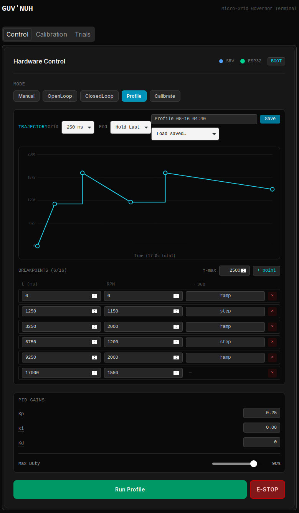
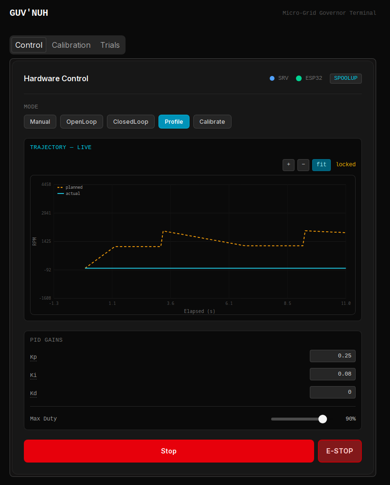
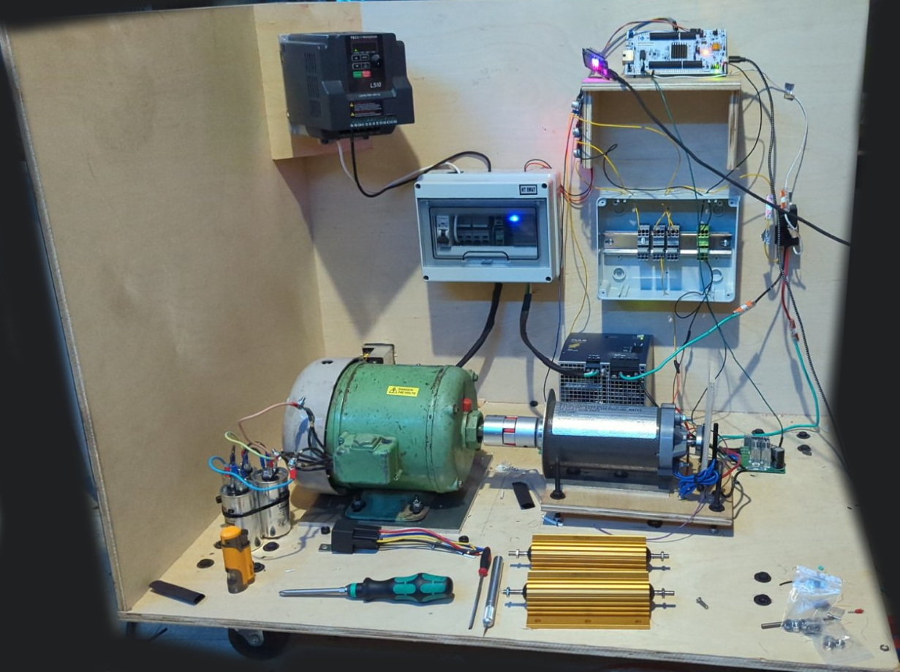

# Guv'nuh – Resilient Micro-Grid Control Platform


> This is showing the calibration step, please see below for HQ screen shot





> This is showing the profile being executed showing planned vs actual rpm in this case


> August 13th (this is going to be as tidy as the left hand side once completed)

A laboratory-scale governor architecture that drives a DC prime mover coupled to a
**self-excited induction generator**, forming a secure, programmable micro-generator
testbed. This platform demonstrates a "Zero-Trust" industrial control loop, fusing
hard real-time safety (STM32/RTIC) with secure cloud telemetry
(Rust/Dioxus/SurrealDB).

---

## Project Purpose

> To engineer a governor reference design that decouples **Physics** (safety
> critical) from **Connectivity** (telemetry), demonstrating the complete
> engineering pipeline from firmware to cloud SCADA — with the architecture
> designed against IEC 61508 and IEEE 1547 as guiding standards, and explicitly
> structured so the DC-motor testbed can be swapped for a real prime mover
> (Phase 4 turbine) with no fundamental firmware changes.

---

## Functional Scope

### Phase 1 — Governor Brains (Current)

| ID | Requirement | Target Value | Status |
| --- | --- | --- | --- |
| **F-01** | Closed-loop speed regulation (PID) | ±2% droop, 0–1 kW range | 🔄 In Progress |
| **F-02** | Overspeed trip to safe state | Software supervisor @ 500 Hz (hardware trip planned) | ✅ Software / 📋 Hardware |
| **F-03** | Load Rejection Response | Recovery < 2s (load step) | 🔄 In Progress |
| **F-04** | Re-entrant MCU Handshake | Either device re-syncs on reboot, any order | ✅ Complete |
| **F-05** | Telemetry Segregation | "Air-gapped" UART Link | ✅ Complete |
| **F-06** | Intranet Telemetry Stream | Live Telemetry over TCP/WiFi | ✅ Complete |
| **F-07** | Prelude-Based Run Configuration | `Configure(RunConfig)` before `Start` | ✅ Complete |
| **F-08** | Live Parameter Adjustment | Duty / RPM / PID gains adjustable mid-run | ✅ Complete |
| **F-09** | Interrupt-Driven Command RX | Overrun-free UART command reception | ✅ Complete |
| **F-10** | Trial Run Recording | Per-trial telemetry to SurrealDB | ✅ Complete |
| **F-11** | Telemetry Visualization | Custom SVG chart primitives, multi-series + metric toggles | ✅ Complete |
| **F-12** | REST Hardware API | Stateless control + data endpoints on :3001 | ✅ Complete |
| **F-13** | Duty→RPM Calibration | On-device least-squares fit with validation | ✅ Complete |
| **F-14** | Feedforward Control | Calibration coefficient seeds PID duty | ✅ Complete |
| **F-15** | Calibration Reporting | Fit + raw points persisted, drift-tracked | ✅ Complete |
| **F-16** | Independent Safety Supervisor | Preemptive overspeed + sensor-plausibility trip, comms-independent | ✅ Complete |
| **F-17** | Fault History & Auto-Close | Faults persisted per-trial; faulted trials self-close | ✅ Complete |
| **F-18** | Setpoint-Profile Trajectories | Sparse `(t, target)` breakpoints executed on-device; commanded-vs-actual overlay | ✅ Complete |
| **F-19** | Profile Library | Named profiles persisted to SurrealDB, upsert-by-name, load into editor | ✅ Complete |
| **F-20** | Prime-Mover Abstraction | `PrimeMover` trait decouples control from actuator (DC motor ↔ turbine) | ✅ Complete |
| **F-21** | Deadline Monitoring | Per-state execution-time budget; trips `DeadlineMiss` fault on sustained overrun | ✅ Complete |

### Phase 2 — EtherCAT Integration

Replaces the UART telemetry link with an EtherCAT fieldbus, enabling
deterministic sub-millisecond communication between the Governor and
downstream field devices. This phase targets industrial interoperability
and positions the platform against real SCADA deployments.

### Phase 3 — 48V Storage Converters

Integrates bidirectional DC-DC converters for a 48V battery storage bank,
enabling islanded operation, load leveling, and grid-forming capability.
Adds a second control loop for state-of-charge management alongside the
existing speed governor.

### Phase 4 — Micro Steam Turbine *(Future Reference)*

> ⚠️ High temperature and pressure — deferred until Phase 1 control logic
> is fully validated and hardened.

Replaces the DC motor testbed with a purpose-built micro steam turbine as
the prime mover, completing the generator set. The Governor architecture
is designed from the ground up to support this transition — the layered
separation (independent safety supervision, prime-mover abstraction,
prime-mover-agnostic control, guard-conditioned sequencing) means the
turbine is a prime-mover swap plus sensor growth, not a rewrite. The
calibration architecture anticipates this fork: the device fits only the
simple relationship it needs to control autonomously, while the server
retains raw sample points for richer analysis (nonlinear maps, drift) that
can evolve without reflashing.

---

## Hardware Under Control

The testbed is a two-machine set, deliberately chosen so the control problem
mirrors a real generator:

- **Prime mover:** a 100 V / 2 HP continuous DC motor, PWM-driven through a
  motor controller, mechanically coupled to the generator shaft. Reaches
  ~2500 RPM at 100% duty. The AMT102-V encoder (QEI, 8192 counts/rev) is the
  speed feedback.
- **Generator:** a 1/2 HP three-phase AC **induction** machine used as a
  generator — nameplate 230 V / 460 V, 1720 RPM full-load (a 4-pole machine,
  1800 RPM synchronous → 60 Hz target). Because it has no permanent magnets, it
  is a **Self-Excited Induction Generator (SEIG)**: it produces only residual
  millivolts when spun bare, and builds real voltage only once a capacitor bank
  across its terminals bootstraps self-excitation. Holding shaft speed at
  1800 RPM holds both 60 Hz and (with stable excitation) the target voltage —
  which is precisely the governor's job.

This is why the `EXCITE` state exists and why voltage/frequency sensing is the
gating next step: the generator's real output only appears once excited, and the
sequencing states advance on measured conditions, not just spin.

---

## System Architecture

```
┌──────────────────────────────────────────────────────────────┐
│                       SAFETY DOMAIN                          │
│                                                              │
│   AMT102-V Encoder ──► STM32H753 (RTIC)                     │
│   INA240 + ADS131M04 ──► (voltage/current front-end — WIP)  │
│                          ├── Safety Supervisor (pri 2, 500Hz)│
│                          │     preemptive overspeed + sensor │
│                          ├── State Machine (14 states, pri 1)│
│                          ├── PID Loop + Feedforward          │
│                          ├── Calibrator (duty→RPM fit)       │
│                          ├── Ramp Generator                  │
│                          ├── MotorController (inverted PWM)  │
│                          ├── UART4 RX ISR (cmd decode, pri 3)│
│                          └── UART TX/RX ──────────────┐      │
└───────────────────────────────────────────────────────┼──────┘
                                                        │ UART
┌───────────────────────────────────────────────────────┼──────┐
│                    TELEMETRY DOMAIN                   │      │
│                                                       ▼     │
│   ESP32-WROOM ◄──── UART RX (GPIO16)                        │
│       ├── Re-entrant Handshake (Hello/HelloAck, framed)     │
│       ├── WiFi (esp-wifi + embassy-net)                      │
│       ├── TCP Server :3000 (bidirectional) ──────────────►  │
│       └── CMD forwarding (TCP → UART → STM32)                │
└──────────────────────────────────────────────────────────────┘
                                          │ TCP/WiFi
┌─────────────────────────────────────────▼────────────────────┐
│                     COMMAND DOMAIN                            │
│                                                              │
│   gaussindustri.es Server (Dioxus Fullstack + Axum)          │
│       ├── ingest_loop: ESP32 TCP → postcard/COBS decode      │
│       ├── Uplink demux: Telemetry / Calibration / handshake  │
│       ├── frame sanity gate: reject non-finite / OOR values  │
│       ├── fault detect → mark + auto-close trial             │
│       ├── SurrealDB: trial + telemetry + calibration storage │
│       ├── live_buffer: frame-indexed ring for polling        │
│       └── REST API :3001 (hardware control + trial data)     │
│                                                              │
│   Desktop Terminal (Dioxus Desktop)                          │
│       ├── Tabs: Control / Calibration / Trials               │
│       ├── Mode-Driven Console: setpoint source swaps by mode │
│       │     Manual / OpenLoop / ClosedLoop / Profile / Cal   │
│       ├── Profile Editor: draggable SVG trajectory + library │
│       ├── Trial Control: Configure→Start / Stop / E-Stop     │
│       ├── Clear Faults: recover FAULT/ESTOP → IDLE           │
│       ├── Live Control: real-time duty adjustment (Manual)   │
│       ├── Calibration Panel: fit stats + points + fit chart  │
│       ├── Connection Status: ESP32 + Server + STM32 state    │
│       ├── Trials Dashboard: accordion list + fault strip     │
│       └── Custom SVG Charts: LineChart + ScatterChart,       │
│             viewport zoom/pan, RPM/V/I/Freq/Temp/DC Bus      │
└──────────────────────────────────────────────────────────────┘
```

### 1. The Governor (STM32H753 + RTIC)

- **Role:** The "Physics Engine."
- **Responsibility:** Independent safety supervision, state machine, PWM motor
  control, encoder RPM sampling, duty→RPM calibration, feedforward + PID control,
  command reception.
- **Safety Supervisor:** A dedicated **priority-2 task at 500 Hz** (five times
  the control loop) monitors overspeed and sensor plausibility using only local
  sensors — no dependency on the ESP32 or server. On an overspeed or an
  implausible (non-finite / out-of-range) RPM reading it forces the motor and
  relay off and slams the machine to `FAULT`, **preempting** the priority-1 state
  machine. The trip ceiling is a `#[shared]` value defaulting to a compiled-in
  safe constant (active from boot with zero config); a server-commanded limit is
  clamped to compiled absolute bounds, so the operator can tune within safety but
  never disable it, and comms loss never removes protection. This is the layer
  that keeps the machine safe even when everything upstream is dead — the
  foundation for a hardware-level overspeed trip (the eventual SIL-2 safety of
  last resort). Recovery sequencing stays in the state machine; the supervisor
  owns only the preemptive trip.
- **Command Reception:** A dedicated **UART4 RX interrupt** (priority 3) drains
  the FIFO the instant bytes arrive, accumulates COBS frames, decodes them into
  `Command`s, and hands them to the priority-1 state machine through a
  `heapless::Deque` queue. This decouples reception speed from the 10 ms control
  tick and eliminates FIFO overrun on multi-byte command frames.
- **Calibration:** A `CALIBRATE` run steps through a fixed set of duty levels,
  lets RPM settle at each, and computes a least-squares `duty → RPM` line
  (slope `k`, intercept, r²) using Welford accumulation for per-point mean and
  standard deviation. A validation gate (minimum r², positive plausible slope,
  per-point coefficient-of-variation ceiling) marks the fit `valid` or rejects
  it — a rejected fit is still reported but does not enable feedforward.
- **Feedforward:** When a valid calibration exists, closed-loop states compute a
  feedforward duty from `k` and the target RPM, so PID trims a small residual
  around an already-near-correct duty instead of integrating up from zero. The
  path is conditional — with no calibration, PID runs exactly as before.
- **Telemetry Task:** Reads the encoder, writes a shared `Measurements` struct,
  assembles a `Telemetry` frame from it, and drives the UART. A single-slot
  `pending_report` mailbox lets the `CALIBRATE` state hand a completed
  calibration report to the telemetry task (the sole owner of the transmitter)
  without two-task contention on `tx`.
- **State Machine:** `BOOT` → `IDLE` → `CONFIGURED` → *(mode-dependent)*, with
  a graceful `RAMP_DOWN` on stop and `FAULT` / `ESTOP` reachable from any state.
- **Re-entrant Handshake:** On boot the STM32 sends a framed `Uplink::Hello`,
  arms the RX interrupt, and proceeds to `IDLE` once a `HelloAck` arrives (or
  after a bounded retry, so a dead gateway never bricks it in `BOOT`). A `Hello`
  arriving mid-run — the gateway rebooting — is answered from *any* state with a
  `HelloAck` **without changing state**, so the machine keeps running while the
  link re-syncs. See "Link Handshake" below.
- **Motor Abstraction:** `MotorController` encapsulates the inverted-PWM logic
  (duty MAX = motor off) behind a `set_speed(fraction)` API with a configurable
  safety duty clamp.

### 2. The Gateway (ESP32-WROOM + esp-hal)

- **Role:** The "Scribe."
- **Responsibility:** Receives telemetry from the STM32 over UART, connects to
  WiFi, and streams data to TCP clients on port 3000. Forwards commands from
  the server back to the STM32 over UART. Participates in the re-entrant
  handshake: announces its own boot with a framed `Command::Hello`, and answers
  the STM32's `Uplink::Hello` locally with a `Command::HelloAck` (no server
  round-trip), so either device can reboot in any order and the link re-syncs.
- **FIFO Draining:** The UART→TCP bridge drains all available bytes per loop
  iteration rather than one byte at a time, so it keeps pace with the 100 Hz
  telemetry stream and the burst of a calibration report without overrunning the
  ESP32's RX FIFO (which would corrupt frames mid-flight).
- **Isolation:** Connected via UART only. The ESP32 cannot directly access
  any Governor control variables — all communication is through a sanitized
  COBS message protocol. The gateway is a dumb byte pipe: it forwards frames
  without interpreting their contents (it peeks only for the framed handshake
  messages), so the wire format can evolve with near-zero gateway changes.

### 3. The Server (Dioxus Fullstack + Axum + SurrealDB)

- **Role:** The "Command Center."
- **Ingest Loop:** Connects to ESP32 over TCP, decodes postcard/COBS frames as
  an `Uplink` enum, and demultiplexes: `Telemetry` frames flow to the live
  buffer and (during a trial) to SurrealDB; `Calibration` frames are persisted
  as calibration records; handshake frames are tolerated and ignored (they are
  normally intercepted at the gateway). A sanity gate rejects telemetry with
  non-finite or physically impossible values so transient wire corruption never
  reaches storage or the chart.
- **Trial System:** Each trial run creates a `trial` record with start/stop
  timestamps, frame count, and status. Telemetry frames are tagged with
  `trial_id` for isolated retrieval.
- **Fault Handling:** When a telemetry frame carries a fault, the server marks
  the trial's status `fault`, records the fault name and stop time, counts the
  frames, and clears the active-trial flag — the trial **auto-closes** on the
  first fault frame (the hardware has already stopped itself via the supervisor,
  so only the record-keeping half of a normal stop runs). Trial-completion logic
  is guarded so a graceful stop never overwrites a `fault` status.
- **Calibration Store:** A completed calibration is stored as a `calibration`
  record — the fit (`k`, intercept, max RPM, r², valid flag) **and** the raw
  sample points (duty, mean RPM, standard deviation, sample count), tagged with
  `rig_id` and the originating `trial_id`. Storing both the reduced fit and the
  raw acquisition mirrors a calibration certificate: the fit is the conclusion,
  the points are the evidence, and successive records reveal mechanical drift.
- **Live Buffer:** A frame-indexed ring buffer feeds the desktop's polling
  chart with a monotonic `ts_s` x-axis derived from frame index (100 Hz), so
  the trace is independent of the STM32 boot clock.
- **Database Transport:** Trial-status writes go over raw HTTP to SurrealDB's
  `/sql` endpoint (the SDK's `/rpc` query transport is unreliable on the current
  setup); a shared helper in the DB module carries the auth and namespace
  headers.
- **REST API (`:3001`):** Stateless hardware control and data query endpoints
  consumed by the desktop terminal.

### 4. The Desktop Terminal (Dioxus Desktop)

- **Role:** The "Operator Console."
- **Tabbed Layout:** Control, Calibration, and Trials, each a focused panel.
- **Mode-Driven Control Console:** One console where the selected **mode**
  (Manual / OpenLoop / ClosedLoop / Profile / Calibrate) is the *setpoint
  source* — the panel swaps only the setpoint-editor region while the status
  bar, PID gains, max-duty clamp, and run controls stay constant. PID gains
  carry hover tooltips explaining each term; a named **preset** can be applied
  with one click. The full `RunConfig` is sent as a prelude before the run.
- **Setpoint-Profile Editor:** In Profile mode, a custom draggable SVG chart
  defines a speed trajectory as sparse `(t, target)` breakpoints with per-
  segment interpolation (linear ramp or step hold) and an end behavior (hold /
  stop / loop). The profile — not ramp/hold timings — owns the run's timing.
  A bidirectional breakpoint table edits the same points. When a profile runs,
  the chart switches to a **commanded-vs-actual overlay**: the planned
  trajectory (dashed) over the live actual RPM (solid), elapsed-time aligned, so
  the PID's tracking of the curve is visible in real time.
- **Profile Library:** Named profiles are saved to SurrealDB (upsert-by-name)
  and loaded back into the editor from an inline picker, with a confirm dialog
  guarding unsaved edits. The library stores the real breakpoints; the fixed-
  size array padding is a firmware-wire concern only.
- **Trial Control:** Start sends `Configure` then `Start` (or pushes the profile
  then starts a closed-loop trial); Stop ramps down gracefully; a dedicated
  Calibrate mode runs the calibration routine; an always-available **E-Stop**
  kills the motor immediately. When the hardware is in `FAULT`/`ESTOP`, a
  **Clear Faults** button (state-gated on the live STM32 state) sends
  `ClearFaults` to return to `IDLE` before another run.
- **Live Control:** In Manual mode, a duty slider streams real-time
  `LiveAdjust(Duty)` commands to the motor while it runs.
- **Custom Chart Primitives:** All charting is done by two reusable in-house SVG
  components (no external charting library) — `LineChart` (multi-series, dual
  y-axis) and `ScatterChart` (markers + error bars + fit overlay). Both are
  **viewport-driven**: scroll to zoom (shift = X-only, ctrl = Y-only), drag to
  pan, double-click to reset, with an auto-follow mode that tracks live data
  until the operator interacts. A shared `ChartControls` widget provides zoom/fit
  buttons for any chart.
- **Calibration Panel:** Shows the latest fit with a validity banner, the fit
  statistics (`k`, intercept, max RPM, r²), the sampled points table, and a
  `ScatterChart` of the points with per-point standard-deviation error bars and
  the fitted line superimposed. A history table tracks the coefficient and fit
  quality across runs to surface mechanical drift over time.
- **State-Aware Trials:** The terminal reads the live STM32 state and closes a
  trial when the hardware returns to `IDLE` on its own, or when a fault
  auto-closes it server-side.
- **Trials Dashboard:** Accordion list of all recorded trials with status,
  timestamps, and frame counts. Faulted trials are flagged (red dot + badge),
  and each trial's detail shows a **fault strip** — every fault that occurred,
  edge-triggered, with the timestamp it tripped, aligned to the RPM trace.
  Charts export to **SVG** (vector) for reports.
- **Metric Toggles:** RPM, Voltage RMS, Current RMS, Frequency, Temperature,
  DC Bus Voltage — each independently toggleable with dual y-axes.
- **Export:** One-click **SVG** (vector) export of charts for reports and client
  deliverables — crisp at any scale, no raster dependency.

---

## State Machine

The Governor's behavior after `Start` is determined by the `RunMode` supplied in
the preceding `Configure` prelude:

```
BOOT ──► IDLE ──(Configure)──► CONFIGURED ──(Start)──┐
                                                     │
        ┌────────────────────────────────────────────┤
        │                                             │
   RunMode::Calibrate ──► CALIBRATE ──────────────────┤ (step duties → fit → report → IDLE)
   RunMode::Manual    ──► MANUAL ────────────────────┤ (live duty control)
   RunMode::OpenLoop  ──► SPOOLUP ───────────────────┤ (ramp, no feedback)
   RunMode::ClosedLoop──► SPOOLUP ───────────────────┤ (feedforward + PID on RPM)
   RunMode::Generate  ──► SPOOLUP ──► EXCITE ──► PLL_LOCK ──► READY ──► GENERATE
                                                                          │
                                                                   LOAD_REJECTION
                                                                          │
        Any running state ──(Stop)──► RAMP_DOWN ──► IDLE                  │
        Any state ──(EmergencyStop)──► ESTOP                             │
        Any state ──(overspeed / sensor / fault)──► FAULT               │
        FAULT / ESTOP ──(ClearFaults | Stop)──► IDLE ◄───────────────────┘
```

`CALIBRATE`, `OpenLoop`, and `ClosedLoop` are validated on hardware today, with
feedforward from calibration feeding the closed-loop path, and the independent
safety supervisor arming an overspeed trip from boot. The full generator sequence
(`EXCITE → PLL_LOCK → READY → GENERATE → LOAD_REJECTION`) is scaffolded with
time-based placeholders pending the ADC voltage/current/frequency front-end; the
`EXCITE` state's real role is capacitor self-excitation of the SEIG, advancing on
measured voltage build-up once that sensing lands.

**Safety layering.** The state machine sequences *operation*; a separate,
higher-priority supervisor enforces *safety* independently. `EmergencyStop` and
overspeed/sensor trips are honored from any state and force the machine safe
before the sequencer runs. Comms loss is deliberately **not** a trip: an off-grid
prime mover must run autonomously (a "heartbeat-or-stop" rule would be a deadly
embrace when the generator is charging the very system that sends the heartbeat),
so the machine degrades to autonomous operation on last-known-good config and
local safety, and the link re-syncs opportunistically when the gateway returns.

---

## Link Handshake

STM32↔ESP32 link establishment is a framed, in-protocol, event-driven handshake —
**not** a heartbeat. It is sent on (re)start and acknowledged; its absence does
nothing (the machine runs autonomously), its presence re-establishes the link.

- **`Hello` / `HelloAck`** are carried in both `Command` (inbound to the STM32)
  and `Uplink` (outbound), so the exchange is symmetric: whoever boots announces
  with `Hello` in its outbound direction, whoever is running replies `HelloAck`.
- **STM32 reboots:** it sends `Uplink::Hello`; the running gateway answers
  `Command::HelloAck` locally. (Old failure mode — STM32 stuck in `BOOT` waiting
  for an `OK` the running gateway would never re-send — is gone.)
- **ESP32 reboots:** it sends `Command::Hello`; the running STM32 answers
  `Uplink::HelloAck` from whatever state it is in, without disturbing operation.
  (Old failure mode — gateway stuck waiting for a `HELLO` the running STM32 would
  never re-send — is gone.)
- The handshake flows through the same COBS/ISR decode path as every other
  message, so it never contends with the raw-byte polling the old ASCII
  handshake required. Either device can be reflashed or power-cycled in any order
  and the link re-syncs on its own.

---

## Calibration & Feedforward

A `CALIBRATE` run characterizes the prime mover and feeds the result back into
control:

1. **Acquisition.** The `Calibrator` holds each of several duty levels for a
   settling period, then samples RPM over a tail window — accumulating mean and
   standard deviation per point via Welford's method (no sample buffering).
2. **Fit.** A least-squares line through the `(duty, mean RPM)` points yields
   the coefficient `k` (RPM per unit duty), the intercept, and r². Extrapolating
   to duty = 1.0 gives a practical max RPM.
3. **Validation.** The fit is accepted only if r² clears a floor, the slope is
   positive and plausible, and every point's coefficient of variation is within
   a ceiling. Low-duty points near the friction floor are the usual failure
   mode — the same absolute encoder noise is a larger *fraction* of a small RPM,
   so the sampled duty band starts above the friction floor and the CV ceiling is
   tuned to reject genuinely noisy points without rejecting honest low-RPM ones.
   A rejected fit is still reported, but does **not** enable feedforward.
4. **Feedforward.** With a valid fit, closed-loop states command a feedforward
   duty derived from `k` and the target RPM; PID then trims the small remaining
   error. The integrator no longer crawls up from zero, which sharpens the
   response — the value of measuring `k` in the first place. (Gains are re-tuned
   *lower* with feedforward active, since PID now corrects only a small residual.)

**Division of labor.** The device computes only the simple linear fit it needs
to control autonomously (a control loop cannot depend on a network round-trip),
and holds it in shared state for feedforward. It reports the raw sample points
upward so the server can perform richer analysis — nonlinear fits, outlier
rejection, drift comparison across runs — and eventually push a lookup table
back down via the `Configure` prelude, all without reflashing firmware attached
to a spinning mass. This is the seam the Phase 4 turbine fork is built around.


---

## Timing & Determinism

The control architecture is instrumented for hard-real-time timing analysis and
enforces its own execution-time deadlines.

### Cycle-accurate measurement

The 100 Hz control loop is instrumented with the Cortex-M7 cycle counter
(`DWT->CYCCNT`, enabled at boot) to measure **per-state execution time**. Each
iteration's elapsed cycles are recorded into a per-state table (max + mean),
giving the observed worst-case execution time of every state at 64 MHz sysclk.

> **Scope, stated precisely:** these are **measurement-based** figures — the
> *maximum observed* execution time over many iterations — not a statically
> proven WCET bound (which would require a pipeline-aware analyzer modelling the
> M7's ART accelerator, branch prediction, and flash wait-states — a planned
> step toward the SIL-2 target). The distinction is deliberate: the numbers are
> honest observations, not guarantees.

### Deadline monitoring & fail-safe (`DeadlineMiss`)

Beyond measuring, the firmware **enforces** timing. Each control iteration's
execution time is checked against a **per-state deadline budget** — a
configurable fraction of the loop period (`DEADLINE_BUDGET_FRAC`, default 80 %),
leaving headroom for the priority-2 safety supervisor's preemption, the UART RX
ISR, and jitter. Only time-critical states carry a deadline (SPOOLUP → GENERATE,
CALIBRATE, MANUAL); BOOT / IDLE / CONFIGURED / FAULT / ESTOP are exempt.

If a deadline-bearing state overruns its budget for `DEADLINE_MISS_STREAK`
(default 3) **consecutive** iterations — a *sustained* degradation, not a
single-sample blip — the firmware trips a `Fault::DeadlineMiss` through the same
fault path as any other trip: motor de-energized, relay open, → `FAULT`. The
consecutive-streak filter is deliberate: a safety check that nuisance-trips on
one anomalous sample gets disabled in practice, which is worse than not having
it.

This is the RTOS deadline-monitoring concept realized on bare-metal RTIC — the
system watches its own real-time behaviour and fails safe when guarantees
degrade. It will not trip under current operation (the loop runs well within
budget), but the detector is **in place ahead of the failure mode**: once the
high-temperature / high-pressure operating regime introduces real timing stress
(sensor-read stalls, heavier control math under load), the response already
exists. Both the budget fraction and the overrun streak are compile-time
constants, tunable per deployment.

---

## REST API Reference

All endpoints served on `:3001`.

| Method | Endpoint | Description |
| --- | --- | --- |
| `GET` | `/api/hw/status` | ESP32 connection state, trial active, current trial ID |
| `POST` | `/api/hw/configure` | Send a `RunConfig` prelude without starting a trial |
| `POST` | `/api/hw/start` | Send `Configure` + `Start`, create trial record |
| `POST` | `/api/hw/adjust` | Send a `LiveAdjust(LiveParam)` while running |
| `POST` | `/api/hw/stop` | Send `Command::Stop`, close trial with frame count |
| `POST` | `/api/hw/clear` | Send `Command::ClearFaults`, return STM32 to `IDLE` |
| `POST` | `/api/hw/estop` | Send `Command::EmergencyStop`, mark trial estopped |
| `GET` | `/api/hw/live` | Poll live frames since a counter (frame-indexed) |
| `GET` | `/api/trials` | List all trials, newest first |
| `GET` | `/api/trials/{id}` | Single trial metadata + all telemetry frames |
| `DELETE` | `/api/trials/{id}` | Delete trial and associated telemetry frames |
| `GET` | `/api/calibration` | Latest calibration record (fit + points) |
| `GET` | `/api/calibration/history` | All calibration records, newest first (drift) |

---

## Data Flow

```
Desktop "Start Trial" → POST /api/hw/start (body: RunConfig)
  → send Command::Configure(RunConfig) → TCP → ESP32 → UART → STM32
      → STM32: IDLE → CONFIGURED
  → SurrealDB: CREATE trial record
  → send Command::Start → TCP → ESP32 → UART → STM32
      → STM32: CONFIGURED → (mode-dependent run state)

STM32 telemetry (100Hz) → UART → ESP32 → TCP → Server
  → postcard::from_bytes_cobs::<Uplink>()
    → Uplink::Telemetry(frame)
      → sanity gate (finite + in-range)
      → live_buffer::push_frame()   (feeds desktop chart)
      → SurrealDB: CREATE telemetry { trial_id, rpm, duty_percent, state, fault, ... }
      → if fault: mark trial 'fault', count frames, auto-close

STM32 calibration complete → Uplink::Calibration(report) → (same pipe)
  → Server: store_calibration
    → SurrealDB: CREATE calibration { rig_id, trial_id, k, intercept,
                                      max_rpm, r_squared, valid, points[...] }

Overspeed / sensor trip (STM32 safety supervisor, pri 2)
  → motor + relay forced off, state → FAULT (preempts state machine)
  → telemetry frame carries fault → server auto-closes trial
  → Desktop: Clear Faults → Command::ClearFaults → STM32 FAULT → IDLE

Desktop live duty drag (Manual) → POST /api/hw/adjust {"Duty": 0.3}
  → Command::LiveAdjust(Duty(0.3)) → TCP → ESP32 → UART → STM32

Desktop "Stop Trial" → POST /api/hw/stop
  → Command::Stop → TCP → ESP32 → UART → STM32: → RAMP_DOWN → IDLE
  → SurrealDB: UPDATE trial SET status='completed' (guarded: never overwrites 'fault')
```

---

## Wire Protocol

All firmware↔server communication uses **postcard** serialization with
**COBS** framing (0x00 delimiter). Uplink frames are wrapped in an `Uplink`
enum so a single byte stream carries telemetry, calibration reports, and the
link handshake; the gateway forwards them opaquely (peeking only for handshake
frames) and the server demultiplexes on decode.

```rust
// shared/src/models/telemetry/telemetry.rs

pub enum Uplink {
    Telemetry(Telemetry),
    Calibration(CalibrationReport),
    Hello,      // STM32 announces (re)start
    HelloAck,   // STM32 acknowledges the gateway's Hello
}

pub struct Telemetry {
    pub ts_ms: u32,
    pub state: STATE,
    pub rpm: f32,
    pub duty_percent: f32,
    pub v_gen_rms: f32,
    pub i_gen_rms: f32,
    pub freq_gen_hz: f32,
    pub theta_err_rad: f32,
    pub temp_c: f32,
    pub dc_bus_v: f32,
    pub run_mode: Option<RunMode>,
    pub fault: Option<Fault>,
}

// Emitted once when a CALIBRATE run completes. Fixed-size arrays only —
// shared is no_std, no heap. The server adds ids/timestamps on store.
pub struct CalibrationReport {
    pub ts_ms: u32,
    pub k_rpm_per_duty: f32,
    pub rpm_intercept: f32,
    pub max_rpm: f32,
    pub r_squared: f32,
    pub points: [CalPointWire; CAL_POINT_COUNT],
    pub point_count: u8,
    pub valid: bool,
}

pub struct CalPointWire {
    pub duty: f32,
    pub rpm_mean: f32,
    pub rpm_stddev: f32,
    pub samples: u32,
}

pub enum Command {
    Ping,
    Configure(RunConfig),   // prelude sent before Start
    Start,
    Stop,
    EmergencyStop,
    LiveAdjust(LiveParam),  // real-time parameter changes
    Set(Setpoints),         // legacy
    ClearFaults,
    Hello,                  // gateway announces (re)start
    HelloAck,               // gateway acknowledges the STM32's Hello
}

pub struct RunConfig {
    pub mode: RunMode,          // OpenLoop | ClosedLoop | Calibrate | Manual | Generate
    pub target_rpm: f32,
    pub ramp_up_ms: u32,
    pub hold_ms: u32,           // 0 = hold indefinitely until Stop
    pub ramp_down_ms: u32,
    pub pid: PidGains,          // kp, ki, kd, output_min, output_max
    pub max_duty_clamp: f32,    // 0.0–1.0 safety limit
    pub target_freq_hz: f32,
    pub target_v_rms: f32,      // setpoint for the future AVR loop (inert until ADC)
    pub max_amperage_clamp: f32,// protection limit for the future current sense (inert until ADC)
}

pub enum Fault {
    OverVoltage,
    UnderVoltage,
    OverCurrent,
    OverTemp,
    OverSpeed,          // supervisor overspeed trip
    NoExcitation,
    PllUnlock,
    SensorOutOfRange,   // supervisor sensor-plausibility trip
    CommLost,           // reserved — comms loss is NOT a trip (see Safety layering)
}

pub enum LiveParam {
    Duty(f32),
    TargetRpm(f32),
    PidGains(PidGains),
    MaxDutyClamp(f32),
    TargetFreqHz(f32),
    TargetVRms(f32),
}
```

---

## Technology Stack

| Layer | Implementation | Rationale |
| --- | --- | --- |
| **Safety Core** | Rust RTIC on STM32H753 | Zero-cost abstractions, data-race freedom |
| **Safety Supervisor** | Priority-2 RTIC task @ 500 Hz | Preemptive overspeed/sensor trip, comms-independent |
| **Determinism** | DWT cycle counter + per-state deadline budgets | Measured execution time; fail-safe trip on sustained overrun |
| **Command RX** | UART4 interrupt + heapless queue | Overrun-free reception, decoupled from control tick |
| **Link Layer** | Framed `Hello`/`HelloAck` over COBS | Re-entrant handshake; either device reboots, any order |
| **Calibration** | On-device least-squares + validation | Autonomous fit; raw points reported for richer server analysis |
| **Control** | Feedforward + PID + Ramp generator | Coefficient-seeded duty, closed-loop trim (tuning WIP) |
| **Telemetry Gateway** | esp-hal + embassy-net on ESP32 | no_std WiFi, memory-safe networking, opaque byte pipe |
| **Transport** | UART (3.3V) + TCP/WiFi | Hardware isolation between domains |
| **Backend** | Axum + SurrealDB (raw `/sql`) | Type-safe async Rust API |
| **Frontend** | Dioxus Fullstack + Desktop | Shared types from firmware to UI |
| **Visualization** | Custom SVG (in-house) | `LineChart` + `ScatterChart`, viewport zoom/pan, SVG export |
| **Desktop** | Dioxus Desktop + reqwest | Native operator console |
| **Safety (future)** | Hardware overspeed trip + Watchdog | Fail-safe torque-off independent of software (design target: SIL-2) |

---

## Repository Structure (Cargo Workspace)

```text
.
├── shared/                    ↳ Wire-safe data models (no_std, serde + postcard)
│   └── src/models/
│       ├── state/states.rs    ↳ STATE enum (14 states) + Fault enum
│       └── telemetry/         ↳ Uplink, Telemetry, CalibrationReport, Command,
│                                RunConfig, LiveParam, PidGains, CalPointWire
├── firmware/
│   ├── stm32/                 ↳ Hard Real-Time Governor (RTIC, no_std)
│   │   └── src/
│   │       ├── main.rs        ↳ State machine, safety supervisor, UART4 RX ISR,
│   │       │                    telemetry task, framed handshake
│   │       ├── models/        ↳ Measurements (shared sensor struct)
│   │       └── guv/
│   │           ├── prime_mover.rs ↳ PrimeMover trait (actuator abstraction seam)
│   │           ├── motor.rs      ↳ MotorController: impl PrimeMover (inverted PWM)
│   │           ├── turbine.rs    ↳ TurbineController skeleton (impl PrimeMover, stub)
│   │           ├── pid.rs        ↳ PID controller (anti-windup, hot-swap gains)
│   │           ├── ramp.rs       ↳ Linear ramp generator
│   │           ├── profile.rs    ↳ SetpointProfile + eval_profile (trajectory exec)
│   │           ├── wcet.rs       ↳ Per-state cycle-count timing + deadline budgets
│   │           ├── calibrate.rs  ↳ Calibrator: duty→RPM fit, validation, feedforward
│   │           └── states/       ↳ boot, calibrate, idle, estop, fault...
│   └── esp32/                 ↳ Telemetry Gateway (esp-hal, no_std)
│       └── src/main.rs        ↳ Framed handshake, WiFi, TCP server, UART bridge
├── gaussindustri.es/          ↳ Fullstack server + desktop terminal (Dioxus 0.7)
│   └── src/
│       ├── backend/           ↳ Axum REST API, SurrealDB (raw /sql), live buffer
│       ├── components/
│       │   └── chart.rs       ↳ LineChart + ScatterChart + Viewport + ChartControls
│       └── views/
│           ├── control.rs     ↳ Mode-driven console + profile editor + overlay
│           ├── trials.rs      ↳ Trials dashboard, custom charts, fault strip
│           └── calibration.rs ↳ Fit panel, ScatterChart with error bars
├── docs/
│   ├── 00_requirements/       ↳ Project Charter
│   ├── 45_µcu_reference/      ↳ STM32H753 + ESP32-WROOM datasheets
│   ├── 50_motor_drive_data/   ↳ INA240, ADS131M04, AMT102-V
│   └── 90_release_notes/      ↳ Roadmap
├── hardware/                  ↳ KiCad sources, BOMs (WIP)
├── githubMedia/               ↳ Preview images
└── ci/                        ↳ GitHub Actions (Cross-compile + Test)
```

---

## Current State (August 2026)

### Validated End-to-End on Hardware

- ✅ STM32H753 boots, asserts safe PWM state, enables relay
- ✅ Independent safety supervisor — preemptive overspeed + sensor-plausibility
     trip at 500 Hz, active from boot, comms-independent
- ✅ Cycle-accurate per-state execution timing (DWT->CYCCNT) — observed
     worst-case measured at 64 MHz
- ✅ Deadline monitoring — per-state execution-time budget (fraction-of-period)
     trips `Fault::DeadlineMiss` on sustained overrun, through the fault path
- ✅ Re-entrant `Hello`/`HelloAck` handshake — either device reboots in any order
     and the link re-syncs (reflash-friendly)
- ✅ AMT102-V rotary encoder reading RPM via QEI (TIM2)
- ✅ PWM motor control via TIM1 (inverted logic) behind `MotorController`
- ✅ Telemetry transmitted over UART to ESP32 (postcard/COBS, 100Hz)
- ✅ ESP32 connects to 2.4GHz WiFi via esp-wifi + embassy-net
- ✅ TCP server on port 3000 streams live telemetry to server
- ✅ ESP32 FIFO-draining UART bridge — no frame corruption under burst load
- ✅ Bidirectional pipeline — desktop commands forwarded to STM32
- ✅ Interrupt-driven UART4 command RX — no FIFO overrun on `Configure` frames
- ✅ Prelude-based configuration — `Configure(RunConfig)` gates `Start`
- ✅ RunMode branching — Calibrate / Manual / OpenLoop / ClosedLoop validated
- ✅ Duty→RPM calibration — on-device least-squares fit with r² + validation
- ✅ Calibration reporting — fit + raw points over `Uplink`, persisted to DB
- ✅ Feedforward control — valid calibration seeds closed-loop duty
- ✅ Live parameter adjustment — real-time duty control in Manual mode
- ✅ Graceful `RAMP_DOWN` on stop; immediate `EmergencyStop` path
- ✅ Server decodes `Uplink` frames with sanity gate, stores to SurrealDB
- ✅ Trial run system — start/stop from desktop, per-trial DB storage
- ✅ Fault history — faults persisted per-trial; faulted trials auto-close and are
     flagged in the dashboard with a per-trial fault strip
- ✅ Clear Faults from the terminal — recover `FAULT`/`ESTOP` → `IDLE`
- ✅ REST API on :3001 (status, configure, start, adjust, stop, clear, estop,
     live, trials, calibration)
- ✅ Desktop terminal — unified mode-driven console (setpoint source swaps by mode)
- ✅ Setpoint-profile system — on-device trajectory execution (`eval_profile`),
     draggable SVG editor, commanded-vs-actual live overlay
- ✅ Profile library — named profiles persisted to SurrealDB (upsert-by-name),
     loaded back into the editor with an unsaved-edits confirm dialog
- ✅ Prime-mover abstraction — `PrimeMover` trait decouples control from the
     actuator; `MotorController` implements it, turbine skeleton stubbed against it
- ✅ Custom SVG chart primitives — `LineChart` (multi-series, dual-axis) +
     `ScatterChart` (markers, error bars, fit); no external charting dependency
- ✅ Viewport zoom/pan on all charts — scroll-zoom (shift=X, ctrl=Y), drag-pan,
     auto-follow-then-lock, shared `ChartControls` widget
- ✅ Calibration panel — fit stats, points table, `ScatterChart` with error bars
- ✅ Trials dashboard with accordion, custom charts, metric toggles, fault strip
- ✅ SVG (vector) export for client reports

### In Progress

- 🔄 PID closed-loop tuning **with feedforward enabled** (gains re-tuned lower)
- 🔄 ADC sensing front-end — **INA240** (current, shunt) + **ADS131M04**
     (4-ch simultaneous-sampling ADC) into the `Measurements` struct. This is the
     keystone: it turns four currently-stubbed features real at once — the
     guard-conditioned transitions, real EXCITE sensing, the AVR loop
     (`target_v_rms`), and current limiting (`max_amperage_clamp`).
- 🔄 SEIG capacitor bank + rectifier + switched DC load (physical build) —
     gated on the incoming PSU; recalibrate **loaded** once built (current `k`
     was measured unloaded)
- 🔄 Full generator sequence (EXCITE / PLL_LOCK / READY / GENERATE) on measured
     conditions rather than time-based placeholders (follows the ADC front-end)
- 🔄 Load rejection detection + recovery logic
- 🔄 Live WebSocket telemetry dashboard (web frontend)
- 🔄 VPS deployment with TLS

### Planned

- 📋 Hardware-interrupt overspeed trip — safety of last resort, independent of any
     software (the eventual SIL-2 layer beneath the software supervisor)
- 📋 Server-settable overspeed ceiling (clamped to compiled bounds) with a red
     trip-line on the live chart
- 📋 Guard-conditioned state transitions over validated `Measurements` — the
     EXCITE→PLL_LOCK→READY predicates (deferred until measurable measurements
     exist, i.e. after the ADC front-end)
- 📋 Sensor validity tagging (per-reading valid/stale) for diagnostic coverage
- 📋 Dedicated `measurement` task (ADC sampling) feeding `Measurements`
- 📋 Server-computed nonlinear feedforward map pushed via `Configure` prelude

---

## Build & Flash

### Prerequisites

```bash
# STM32 toolchain
rustup target add thumbv7em-none-eabihf
cargo install probe-rs-tools

# ESP32 toolchain
cargo install espup espflash
espup install
. ~/export-esp.sh  # add to ~/.bashrc

# Server
cargo install dioxus-cli
```

### Environment

```bash
# firmware/esp32/.env
WIFI_SSID=your_ssid
WIFI_PASS=your_password
TCP_PORT=3000

# gaussindustri.es/.env
SURREAL_ENDPOINT=ws://127.0.0.1:8000
SURREAL_USER=root
SURREAL_PASS=root
SURREAL_NS=gaussindustries
SURREAL_DB=main
ESP32_ADDR=192.168.1.189:3000
```

### Run

```bash
# Terminal 1 — Database
surreal start --user root --pass root

# Terminal 2 — Server
cd gaussindustri.es && dx serve

# Terminal 3 — Firmware
cd 00_Guv'nuh
cargo stm32-flash
. ~/export-esp.sh && cargo esp32-flash

# Terminal 4 — Desktop Terminal
cd gauss-terminal && dx serve --platform desktop
```

### Verify

```bash
# Check ESP32 TCP
nc <esp32_ip> 3000

# Check REST API
curl http://localhost:3001/api/hw/status
curl http://localhost:3001/api/trials
curl http://localhost:3001/api/calibration

# Send a calibration prelude + start (example)
curl -X POST http://localhost:3001/api/hw/start \
  -H "Content-Type: application/json" \
  -d '{"mode":"Calibrate","target_rpm":0,"ramp_up_ms":5000,"hold_ms":5000,
       "ramp_down_ms":5000,"pid":{"kp":1.0,"ki":0.0,"kd":0.0,
       "output_min":0.0,"output_max":1.0},"max_duty_clamp":1.0,
       "target_freq_hz":60.0,"target_v_rms":120.0,"max_amperage_clamp":1.0}'
```

---

## Standards & Design Targets

The architecture is designed with the following standards as references. They
inform the safety life-cycle, interconnection behavior, and coding discipline —
they are design targets guiding development, not claims of certified compliance.

- **IEC 61508 (SIL-2)** – Functional safety life-cycle & diagnostics *(target)*.
  The independent, preemptive safety supervisor and the planned hardware
  overspeed trip are the first structural steps toward this; full diagnostic
  coverage and sensor-validity tagging are on the roadmap.
- **IEEE 1547** – Interconnection and interoperability of distributed energy resources
- **Rust 2024 / high-integrity guidelines** – Data-race freedom, `#![no_std]` firmware

---

© 2026 Juan Carlos Mancilla Jr · MIT License
