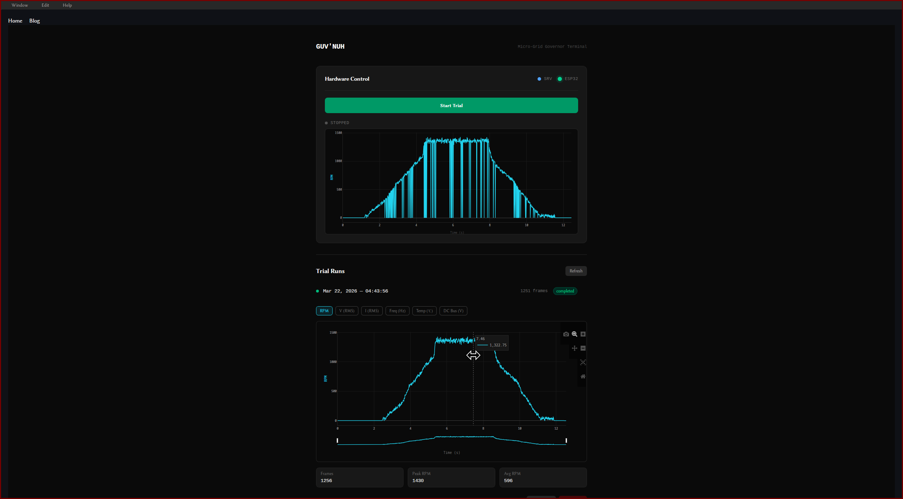

# Guv'nuh – Resilient Micro-Grid Control Platform




A laboratory-scale governor architecture that converts a standard DC motor into a
**secure, programmable micro-generator testbed**. This platform demonstrates a
"Zero-Trust" industrial control loop, fusing hard real-time safety (STM32/RTIC)
with secure cloud telemetry (Rust/Dioxus/SurrealDB).

---

## Project Purpose

> To engineer a NERC-CIP compliant governor reference design that decouples
> **Physics** (Safety Critical) from **Connectivity** (Telemetry), demonstrating
> the complete engineering pipeline from PCB design to Cloud SCADA.

---

## Functional Scope

### Phase 1 — Governor Brains (Current)

| ID | Requirement | Target Value | Status |
| --- | --- | --- | --- |
| **F-01** | Closed-loop speed regulation | ±2% droop, 0–1 kW range | 🔄 In Progress |
| **F-02** | Overspeed trip to safe torque-off | < 12 ms (Hardware Interrupt) | 🔄 In Progress |
| **F-03** | Load Rejection Response | Recovery < 2s (100% → 0% Load Step) | 🔄 In Progress |
| **F-04** | "Apollo 9" Boot Handshake | Machine locked until Cloud Authorization | ✅ Complete |
| **F-05** | Telemetry Segregation | "Air-gapped" UART Link | ✅ Complete |
| **F-06** | Intranet Telemetry Stream | Live Telemetry over TCP/WiFi | ✅ Complete |
| **F-07** | Desktop Trial Control | Start/Stop from Dioxus Desktop App | ✅ Complete |
| **F-08** | Trial Run Recording | Per-trial telemetry to SurrealDB | ✅ Complete |
| **F-09** | Telemetry Visualization | Plotly.js time-series with metric toggles | ✅ Complete |
| **F-10** | REST Hardware API | Stateless control + data endpoints on :3001 | ✅ Complete |

### Phase 2 — EtherCAT Integration

Replaces the UART telemetry link with an EtherCAT fieldbus, enabling
deterministic sub-millisecond communication between the Governor and
downstream field devices. This phase targets industrial interoperability
and positions the platform against real SCADA deployments.

### Phase 3 — 48V Storage Converters

Integrates bidirectional DC-DC converters for a 48V battery storage bank,
enabling islanded operation, load leveling, and grid-forming capability.
Adds a second control loop for state-of-charge management alongside the
existing speed governor.

### Phase 4 — Micro Steam Turbine *(Future Reference)*

> ⚠️ High temperature and pressure — deferred until Phase 1 control logic
> is fully validated and hardened.

Replaces the DC motor testbed with a purpose-built micro steam turbine as
the prime mover, completing the generator set. The Governor architecture
is designed from the ground up to support this transition — the state
machine, safety interlocks, and telemetry pipeline require no fundamental
changes, only physical plant reconfiguration.

---

## System Architecture

```
┌──────────────────────────────────────────────────────────────┐
│                       SAFETY DOMAIN                          │
│                                                              │
│   AMT102-V Encoder ──► STM32H753 (RTIC)                     │
│   ACS772 Current   ──►   ├── State Machine                  │
│   ADS131M04 ADC    ──►   ├── PID Loop (WIP)                 │
│                          ├── PWM Motor Control               │
│                          ├── Command::Start/Stop Listener    │
│                          └── UART TX/RX ──────────────┐      │
└───────────────────────────────────────────────────────┼──────┘
                                                        │ UART
┌───────────────────────────────────────────────────────┼──────┐
│                    TELEMETRY DOMAIN                   │      │
│                                                       ▼     │
│   ESP32-WROOM ◄──── UART RX (GPIO16)                        │
│       ├── Handshake Manager                                  │
│       ├── WiFi (esp-wifi + embassy-net)                      │
│       ├── TCP Server :3000 (bidirectional) ──────────────►  │
│       └── CMD forwarding (TCP → UART → STM32)                │
└──────────────────────────────────────────────────────────────┘
                                          │ TCP/WiFi
┌─────────────────────────────────────────▼────────────────────┐
│                     COMMAND DOMAIN                            │
│                                                              │
│   gaussindustri.es Server (Dioxus Fullstack)                 │
│       ├── ingest_loop: ESP32 TCP → postcard/COBS decode      │
│       ├── SurrealDB: trial + telemetry storage               │
│       ├── tokio::broadcast: live WebSocket feed              │
│       └── REST API :3001 (Hardware control + trial data)     │
│                                                              │
│   Desktop Terminal (Dioxus Desktop)                          │
│       ├── Trial Control: Start/Stop via REST                 │
│       ├── Connection Status: ESP32 + Server indicators       │
│       ├── Trials Dashboard: Accordion list of recorded runs  │
│       └── Plotly.js Charts: RPM, V, I, Freq, Temp, DC Bus   │
└──────────────────────────────────────────────────────────────┘
```

### 1. The Governor (STM32H753 + RTIC)

- **Role:** The "Physics Engine."
- **Responsibility:** State machine, PWM motor control, encoder RPM sampling,
  safety interlocks, command reception.
- **Key Feature:** Priority-based preemption. `ESTOP` (Priority 5) and
  `Load Rejection` (Priority 3) instantly preempt telemetry tasks (Priority 1).
- **State Machine:** `BOOT` → `IDLE` → `CALIBRATE` → `GENERATE` →
  `LOAD_REJECTION` → `ESTOP` / `FAULT`
- **Boot Handshake:** STM32 repeatedly sends `HELLO` over UART until ESP32
  responds `OK`, then transitions to `IDLE` and waits for a `Command::Start`
  from the desktop application before beginning any mechanical sequence.
- **Command Protocol:** Receives COBS-encoded `Command` enum over UART.
  `Start` triggers calibration, `Stop` aborts and returns to idle.

### 2. The Gateway (ESP32-WROOM + esp-hal)

- **Role:** The "Scribe."
- **Responsibility:** Receives telemetry from the STM32 over UART, connects to
  WiFi, and streams data to TCP clients on port 3000. Forwards commands from
  the server back to the STM32 over UART.
- **Isolation:** Connected via UART only. The ESP32 cannot directly access
  any Governor control variables — all communication is through a sanitized
  COBS message protocol.
- **Bidirectional:** TCP→UART command forwarding enables the desktop app to
  control the STM32 through the full pipeline.

### 3. The Server (Dioxus Fullstack + Axum + SurrealDB)

- **Role:** The "Command Center."
- **Ingest Loop:** Connects to ESP32 over TCP, decodes postcard/COBS telemetry
  frames, broadcasts to WebSocket subscribers, and stores to SurrealDB during
  active trials.
- **Trial System:** Each trial run creates a `trial` record with start/stop
  timestamps, frame count, and status. Telemetry frames are tagged with
  `trial_id` for isolated retrieval.
- **REST API (`:3001`):** Stateless hardware control and data query endpoints
  consumed by the desktop terminal.

### 4. The Desktop Terminal (Dioxus Desktop)

- **Role:** The "Operator Console."
- **Trial Control:** Start/Stop button with ESP32 connection indicator (live
  polling). Gated — cannot start without ESP32 connected.
- **Trials Dashboard:** Accordion list of all recorded trials with status,
  timestamps, and frame counts. Expand to view interactive Plotly.js charts.
- **Metric Toggles:** RPM, Voltage RMS, Current RMS, Frequency, Temperature,
  DC Bus Voltage — each independently toggleable with dual y-axes.
- **Export:** One-click PNG export of charts for reports and client deliverables.

---

## REST API Reference

All endpoints served on `:3001`.

| Method | Endpoint | Description |
| --- | --- | --- |
| `GET` | `/api/hw/status` | ESP32 connection state, trial active, current trial ID |
| `POST` | `/api/hw/start` | Create trial record, send `Command::Start` to STM32 |
| `POST` | `/api/hw/stop` | Send `Command::Stop`, close trial with frame count |
| `GET` | `/api/trials` | List all trials, newest first |
| `GET` | `/api/trials/{id}` | Single trial metadata + all telemetry frames |
| `DELETE` | `/api/trials/{id}` | Delete trial and associated telemetry frames |

---

## Data Flow

```
Desktop "Start Trial" → POST /api/hw/start
  → SurrealDB: CREATE trial record
  → mpsc channel → ingest_loop
    → postcard::to_slice_cobs(&Command::Start)
      → TCP to ESP32 → UART to STM32
        → STM32: IDLE → CALIBRATE

STM32 telemetry (100Hz) → UART → ESP32 → TCP → Server
  → postcard::from_bytes_cobs::<Telemetry>()
    → broadcast channel (WebSocket subscribers)
    → SurrealDB: CREATE telemetry { trial_id, rpm, state, ... }

Desktop "Stop Trial" → POST /api/hw/stop
  → Command::Stop → TCP → ESP32 → UART → STM32: → IDLE
  → SurrealDB: UPDATE trial SET status='completed', frame_count=N
```

---

## Wire Protocol

All firmware↔server communication uses **postcard** serialization with
**COBS** framing (0x00 delimiter).

```rust
// shared/src/models/telemetry/telemetry.rs
pub struct Telemetry {
    pub ts_ms: u32,
    pub state: STATE,
    pub rpm: f32,
    pub v_gen_rms: f32,
    pub i_gen_rms: f32,
    pub freq_gen_hz: f32,
    pub theta_err_rad: f32,
    pub temp_c: f32,
    pub dc_bus_v: f32,
}

pub enum Command { Start, Stop, Set(Setpoints), ClearFaults, Ping(u32) }
```

---

## Technology Stack

| Layer | Implementation | Rationale |
| --- | --- | --- |
| **Safety Core** | Rust RTIC on STM32H753 | Zero-cost abstractions, data-race freedom |
| **Telemetry Gateway** | esp-hal + embassy-net on ESP32 | no_std WiFi, memory-safe networking |
| **Transport** | UART (3.3V) + TCP/WiFi | Hardware isolation between domains |
| **Backend** | Axum + SurrealDB | Type-safe async Rust API |
| **Frontend** | Dioxus Fullstack + Desktop | Shared types from firmware to UI |
| **Visualization** | Plotly.js | Interactive charts, PNG export for reports |
| **Desktop** | Dioxus Desktop + reqwest | Native operator console |
| **Control** | PID + Feed-Forward (WIP) | Handling drastic load rejection events |
| **Safety** | Hardware Interrupt + Watchdog (WIP) | SIL-2 compliant fail-safe |

---

## Repository Structure (Cargo Workspace)

```text
.
├── shared/                    ↳ Wire-safe data models (no_std, serde + postcard)
│   └── src/models/
│       ├── state/states.rs    ↳ STATE enum (BOOT, IDLE, CALIBRATE, ...)
│       └── telemetry/         ↳ Telemetry struct, Command enum, Setpoints
├── firmware/
│   ├── stm32/                 ↳ Hard Real-Time Governor (RTIC 2.0, no_std)
│   │   └── src/
│   │       ├── main.rs        ↳ State machine, command listener, RPM monitor
│   │       └── guv/states/    ↳ boot, calibrate, idle, estop, fault...
│   └── esp32/                 ↳ Telemetry Gateway (esp-hal, no_std)
│       └── src/main.rs        ↳ Handshake, WiFi, TCP server, UART bridge
├── docs/
│   ├── 00_requirements/       ↳ Project Charter
│   ├── 45_µcu_reference/      ↳ STM32H753 + ESP32-WROOM datasheets
│   ├── 50_motor_drive_data/   ↳ ACS772, ADS131M04, INA240, AMT102-V
│   └── 90_release_notes/      ↳ Roadmap
├── hardware/                  ↳ KiCad sources, BOMs (WIP)
├── githubMedia/               ↳ Preview images
│   └── Guv_Alpha_Preview.png
└── ci/                        ↳ GitHub Actions (Cross-compile + Test)
```

---

## Current State (March 2026)

### Validated End-to-End on Hardware

- ✅ STM32H753 boots, asserts safe PWM state, enables relay
- ✅ UART handshake between STM32 and ESP32 (`HELLO` / `OK`)
- ✅ AMT102-V rotary encoder reading RPM via QEI (TIM2)
- ✅ PWM motor control via TIM1 (inverted logic, 20kHz)
- ✅ Telemetry transmitted over UART to ESP32 (postcard/COBS, 100Hz)
- ✅ ESP32 connects to 2.4GHz WiFi via esp-wifi + embassy-net
- ✅ TCP server on port 3000 streams live telemetry to server
- ✅ Bidirectional pipeline — desktop commands forwarded to STM32
- ✅ STM32 waits in IDLE for `Command::Start` before calibration
- ✅ `Command::Stop` aborts calibration and returns to IDLE
- ✅ Server connects to ESP32, decodes COBS frames, stores to SurrealDB
- ✅ Trial run system — start/stop from desktop, per-trial DB storage
- ✅ REST API on :3001 for desktop terminal
- ✅ Desktop terminal with connection indicators and trial control
- ✅ Trials dashboard with accordion, Plotly.js charts, metric toggles
- ✅ PNG export for client reports

### In Progress

- 🔄 PID closed-loop speed control
- 🔄 Load rejection state + recovery logic
- 🔄 Live WebSocket telemetry dashboard (web frontend)
- 🔄 VPS deployment with TLS

---

## Build & Flash

### Prerequisites
```bash
# STM32 toolchain
rustup target add thumbv7em-none-eabihf
cargo install probe-rs-tools

# ESP32 toolchain
cargo install espup espflash
espup install
. ~/export-esp.sh  # add to ~/.bashrc

# Server
cargo install dioxus-cli
```

### Environment
```bash
# firmware/esp32/.env
WIFI_SSID=your_ssid
WIFI_PASS=your_password
TCP_PORT=3000

# gaussindustri.es/.env
SURREAL_ENDPOINT=ws://127.0.0.1:8000
SURREAL_USER=root
SURREAL_PASS=root
SURREAL_NS=gaussindustries
SURREAL_DB=main
ESP32_ADDR=192.168.1.6:3000
```

### Run
```bash
# Terminal 1 — Database
surreal start --user root --pass root

# Terminal 2 — Server
cd gaussindustri.es && dx serve

# Terminal 3 — Firmware
cd 00_Guv'nuh
cargo stm32-flash
. ~/export-esp.sh && cargo esp32-flash

# Terminal 4 — Desktop Terminal
cd gauss-terminal && dx serve --platform desktop
```

### Verify
```bash
# Check ESP32 TCP
nc <esp32_ip> 3000

# Check REST API
curl http://localhost:3001/api/hw/status
curl http://localhost:3001/api/trials
```

---

## Milestone Road-map (Jan – June 2026)

| Month | Deliverable | Status |
| --- | --- | --- |
| **Jan** | M-G Set & RTIC Boot | ✅ Complete |
| **Feb** | "Apollo 9" Handshake + UART Telemetry | ✅ Complete |
| **Mar** | WiFi Gateway + TCP Streaming + Trial System + Desktop Terminal | ✅ Complete |
| **Apr** | PID & Feed-Forward, Load Rejection | 🔄 In Progress |
| **May** | Cloud Dashboard (Dioxus Web) + VPS Deployment | 🔄 Upcoming |
| **Jun** | Portfolio Release + CI/CD Freeze | 🔄 Upcoming |

---

## Standards Referenced

- **IEC 61508 SIL-2** – Safety life-cycle & diagnostics
- **NERC CIP-003** – Cyber Security — Security Management Controls
- **IEEE 1547** – Interconnection and Interoperability of Distributed Energy Resources
- **MISRA C / Rust 2024** – High-integrity coding guidelines

---

© 2026 Juan Carlos Mancilla Jr · MIT License
